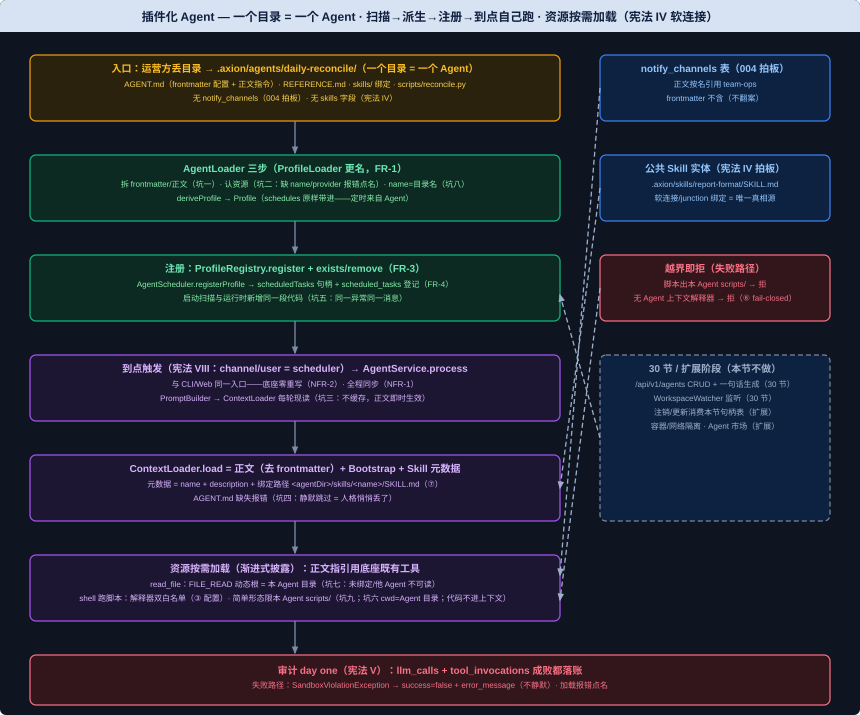

# 插件化 Agent 模块设计文档

> 需求编号：011-plugin-agent | 对应课件第 29 节《插件化 Agent：一个目录定义一个会自己跑的 Agent》
> 文档依据：`docs/TechnicalSolution.md` §11.1/§11.2（权威设计源）+ §6.7/§8.2/§8.3/§12.3、`docs/DemandAnalysis.md` §5.1/§5.2、`docs/AiProgrammingGuide.md` §6（增量阶段）、宪法 IV/VIII（`.specify/memory/constitution.md`）、课件第 29 节（新版 PDF 已 PyMuPDF 提取，9 页全文复核）
>
> 修订说明（2026-09-13）：
>
> ① **课件口径**：核心阶段范围 = 课件 §二「本节交付物」（目录扫描 → 派生 → 注册 + 运行时注册就位 + L3 脚本沙箱 + daily-reconcile 示例 Agent）；课件 §2.4「先别做」清单全部进「明确不做」。
> ② **冲突拍板一——Skill 模型（用户拍板 2026-09-13，按宪法 IV）**：课件"skill 收进 Agent 目录内部、不做跨 Agent 共享能力库" vs 宪法 IV/技术方案 §11.1"公共 Skill 实体存 `.axion/skills/`、Agent 以相对软连接绑定、软连接集合是唯一绑定真相源"——**按宪法 IV**。理由：零回退（ContextLoader 已按软连接模型交付并测试钉死，002 起）；共享规范单点维护不漂移（报告规范/合规清单这类子指令天生跨 Agent 复用）；绑定层是 30 节「一句话生成 + Skill 治理」的接缝。课件 §1.3 示例的 `skills/report-format.md` 按宪法 IV 落为公共实体 `.axion/skills/report-format/SKILL.md` + Agent 目录软连接绑定。
> ③ **冲突拍板二——notify_channels（用户拍板 2026-09-13，按 004 拍板）**：课件示例 frontmatter 内联 `notify_channels: [{type: webhook, url: ...}]` vs 004-notify 拍板（2026-09-03）"SQLite 全局注册表、frontmatter 不含此字段、正文按渠道名引用"——**按 004 拍板**。理由：渠道是第一类可管理资源（密钥轮换改一行、30 节管理台直接管 CRUD）；已交付已人工验收，零回退。daily-reconcile 示例据此改写（正文按名引用渠道，渠道实体落 `notify_channels` 表）。
> ④ **命名拍板**：课件交付物点名 `AgentLoader`（CLAUDE.md 原则四/技术方案 §11.2/DemandAnalysis §5.2 同口径）——003 交付的 `ProfileLoader` **更名**为 `AgentLoader`，承担"拆 frontmatter/正文 + 认资源 + 派生 Profile"三职责；`ProfileLoaderTest` → `AgentLoaderTest`（003 交付物演进，装配处引用同步更名）。
> ⑤ **正文即时生效（无缓存）沿用 002 铁律**：正文**不进 Profile 值对象**——ContextLoader 每轮从 `AGENT.md` 现读并去 frontmatter（坑五同款：缓存正文则"改完即时生效"破产）。资源路径一律由 `workspaceRoot + profile.name` 派生，不给 `Profile` 加字段（正文与资源目录的"绑定"是路径级绑定，Profile 已有 name 足够——为实现级明确）。
> ⑥ **L3 脚本沙箱机制（③ 拍板配置化，2026-09-13）**：解释器集合由**新配置键 `shell.allowed_interpreters`** 提供（不硬编码）——解释器命令首 token 须**同时命中** `shell.allowed_commands` 与 `shell.allowed_interpreters` 双白名单（声明了但未进 commands 的解释器构造期 WARN：永不命中，启动诊断只含配置键名）。**简单形态钉死（坑九）**：解释器命令只接受"解释器 + 单个 `scripts/` 下相对路径参数（+ 可选脚本参数）"形态——token[1] 必须是 `scripts/` 下相对路径、token[2..] 作为脚本参数透传（Clarifications 2026-09-13：安全边界是脚本路径本身，脚本 = 信任的代码，参数不进攻击面）；解释器与脚本路径之间的选项（`-c`/`-u`）、引号、shell 元字符（`;`/`|`/`&`/`$()`/反引号）等一切链式形态**一律拒绝**（首 token 校验挡不住 `python scripts/x.py ; curl ...` 链式穿透；课件与技术方案 §12.3 示例均为简单形态，钉死零牺牲）；`ProfileContext` 无当前 Agent 时解释器命令**一律拒绝**（fail-closed）；`ShellTools` 仅对解释器命令把子进程 cwd 设为 Agent 目录（存量 `ls`/`cat` 等命令行为不变）。技术方案 §12.3 口径落地："`shell.allowed_commands` 放行 `python`、`file.allowed_paths` 限定到该 Agent 的 `scripts/` 目录"。
> ⑦ **Skill 注入路径改为绑定点（对齐技术方案 §12.2）**：ContextLoader 注入 `<agentDir>/skills/<name>/SKILL.md`（**绑定路径**，经软连接/junction 透传读公共实体）；FILE_READ 动态白名单 = 当前 Agent 目录——未绑定 Skill 的实体路径不在 Agent 目录下，天然不可读（未绑定不可见，宪法 IV 渐进式披露守点）。技术方案 §12.2 验收原文"`tool_invocations` 有对 Agent 本地软连接路径的 `read_file`"即此口径。
> ⑧ **工具引用告警不重复实现**：课件校验清单"tools 里引用底座未注册的能力 → 加载告警"已由 005 交付的装配处校验覆盖（ERROR 日志、不阻断启动，CliAgentConfiguration.validateToolRefs）；校验必须落在同时看得到 Profile 与 ToolRegistry 的装配层（core 不得反向依赖 tool），本节沿用不新增实现与测试。**已知缺口**：该校验只在启动路径执行，30 节运行时注册路径须在注册入口再跑同一校验（跨节契约点名，届时补齐）。
> ⑨ **Demo 前置解锁 shell 白名单**：010 FR-7 曾定"file/shell 保持 007 原状（两个 Demo 用不上）"——本节 Demo 需要跑 `python` 脚本，该结论到期解锁：`shell.allowed_commands` 增补 `python`/`bash`（已有配置键加条目，非新键）。
> ⑩ **存量 Agent 迁移注记（2026-09-13 四维分析补齐）**：现有 `weather`/`default` 等存量 Agent 的 `identity.prompt` 与正文高度重复——正文注入后两者同时进 system prompt，**重复人格、token 膨胀**。迁移口径：存量 Agent 人工去重（`identity.prompt` 留人格、正文留任务步骤），人工验收含一次存量 Agent 对话核对（见验收标准·人工部分）。

## 背景与价值

先回答一门课悬着的问题——凭什么叫 OS：一个能跑单个程序的东西不叫 OS；OS 的定义是"一套内核之上，能装、能跑任意多个程序，彼此隔离、不改内核、免重编译"——让它成为 OS 的从来不是内核有多强，而是那套"定义一个程序、把它装上去、让它跑起来"的标准机制（可执行文件格式 + 加载器 + 调度）（课件 §开篇）。

到 28 节为止，底座（内核）造齐了——Provider、ReAct、内置 Tool、Memory、Sandbox、定时、Web，这些系统基础能力所有 Agent 共享（技术方案 §11.1）。但此刻想跑一个业务 Agent，还得把指令硬写进配置、手工拼装：**缺的正是那套"定义一个 Agent、把它装上去、让它跑起来"的标准机制**——做完这一节，"定义一个 Agent"退化成往 `.axion/agents/` 丢一个目录：任意多个、互不干扰、不动底座、到点自己跑。Axion 才从"一个能跑 Agent 的框架"真正变成"一台能跑 N 个 Agent 的 OS"（课件 §开篇/§1.1）。

贯穿本节一条原则：**不重写底座，只给 Profile 添一个来源**。底座（16~28 节）——`AgentService`、`ReActLoop`、`PromptBuilder`、`AgentScheduler`——都是吃 `Profile` 这个值对象的；本节一行底座都不动，只是把"从 Agent 目录的 `AGENT.md` frontmatter 派生 Profile"坐实成唯一来源（`AgentLoader.deriveProfile`），走同一套注册和校验——派生 Profile 就等于让 Agent 目录零改动复用整台底座，触发一次跟 CLI / Web 人推走同一个 `AgentService.process`（课件 §二、技术方案 §11.2）。

形态借鉴 Anthropic Agent Skills 的**目录 + 渐进式披露**，但定义的是 Agent：在 Axion，**一个目录 = 一个 Agent**，"skill"只是这个 Agent 目录里的一个组成部分（指向公共实体的软连接绑定视图），不是顶层单位；不做跨 Agent 的 `use_skill`/能力库/全局索引（技术方案 §11.1、宪法 IV）。一个 Agent 目录里的东西按需分阶段进上下文：正文常驻 system prompt（ContextLoader 现读）、子指令/参考用到才 `read_file`、脚本用到才 `shell` 跑（产出进上下文、代码不进）（课件 §1.2/§1.4、技术方案 §11.1）。

安全边界落在 L3 脚本：Agent 的脚本经底座 shell/python 跑，沙箱放行"解释器（python/bash）+ 限定只能跑这个 Agent 自己 `scripts/` 目录下的脚本"。**必须说清的信任边界**：脚本是任意代码，`python scripts/foo.py` 一旦放行，它能读写文件、能自己发网络请求——绕过 `http_get` 那道域名白名单（白名单只管内置工具，管不到子进程的网络）。**装一个带脚本的 Agent = 信任写它的人**；核心阶段沙箱对脚本只做"解释器 + 目录"两道白名单，容器/网络隔离是扩展阶段的事（课件 §2.4、技术方案 §12.3）。

## 用户场景

**场景一（本节验收场景）：运营方丢一个目录，一个 Agent 上线并到点自己跑**——运营方把 `daily-reconcile/`（AGENT.md + REFERENCE.md + skills/ 绑定 + scripts/reconcile.py）放进 `.axion/agents/`，启动扫描后 `axion profile list` / `GET /api/v1/profiles` 出现这个 Agent；到它声明的 `schedules` 时间点自动跑完"想 → 调系统能力 → 答 → 推送"，`llm_calls`/`tool_invocations` 逐笔留账——全程没写一行 Java、没动一行底座（课件 §1.1 终点、§三）。

**场景二：正文改完即时生效**——运营方改 `daily-reconcile/AGENT.md` 正文里的措辞（如报告推送渠道名），**不重启**，下一轮触发就用新说明；改 frontmatter 里 provider/model/temperature/schedules 才需重启（课件 §2.2、§三）。

**场景三：资源按需加载，代码不进上下文**——正文说"报告规范见 skills/report-format"→ 模型按 ContextLoader 注入的绑定路径用底座 `read_file` 读进来（出现差异那一步才读）；正文说"运行 `python scripts/reconcile.py`"→ 模型用底座 `shell` 跑，**脚本产出的 JSON 进上下文、脚本代码不进**，确定性抓数不烧 token（课件 §1.4/§2.2、技术方案 §11.1）。

**场景四：最小权限，两个 Agent 互不越界**——实例上并存 A/B 两个 Agent：A 的对话里 `read_file` 拿不到 B 的 `REFERENCE.md`（FILE_READ 动态白名单 = 当前 Agent 目录）；A 的 `shell` 跑不了 B 的 `scripts/` 下脚本（解释器命令脚本路径限本 Agent）；未绑定的 Skill 实体路径不在 Agent 目录下，不可读（宪法 IV 渐进式披露、课件 §2.2/§2.4）。

**场景五：两条录入一条路（为 30 节铺路）**——`ProfileRegistry` 补 `register/remove/exists`、`AgentScheduler` 抽 `registerProfile` + 句柄表：30 节的 API 上传和手工丢目录汇入同一段"派生 + 注册 + 注册定时"代码，同一套校验、同一异常、同一消息——运行时新增 Agent 与启动扫描行为一模一样（课件 §2.4、技术方案 §11.3）。

## 功能需求

> 从课件 29 节 §二与技术方案 §11.1/§11.2/§12.3 提炼：交付物列是本节对外概念的白名单，清单之外的新增对外概念必须停下报告。

| 编号 | 需求 | 交付物（落位模块） | 来源 |
|------|------|-------------------|------|
| FR-1 | **`AgentLoader`（`ProfileLoader` 更名 + 扩职责，003 交付物演进）**：解析 `.axion/agents/<name>/` 目录——读 `AGENT.md` **拆出 frontmatter（配置）与正文（指令）**（frontmatter 剥离后正文原样、不做二次加工，**坑一**：拆分与派生必须同一解析器，两套解析各拆各的会 frontmatter/正文错位）；**认出资源** `scripts/`、`skills/`、`REFERENCE.md` 所在（`detectResources(agentDir)`）；`deriveProfile(agentDir, providerNames)` 把 frontmatter 映射成 `Profile`（003 已有：缺 name/provider 报错**点名文件与缺失键**——**坑二**：报错不点名，运营方对着 N 个 Agent 目录猜不出来）；**校验 frontmatter `name` 与目录名一致**（课件"唯一标识 = 目录名"——**坑八**：不校验则注册成功、ContextLoader 每轮按 `profile.name` 找错目录、首次触发才炸的晚失败）；schedules 解析含 id 校验（010 ⑦c：id 缺失启动报错）；`loadAll(agentsRoot, providerNames)` 扫描注册前身（003 已有，单目录失败记错误日志跳过不阻断启动） | `AgentLoader`（axion-core；`ProfileLoader` 删除，装配处与测试同步更名） | 课件 §1.3/§2.1；技术方案 §11.2；DemandAnalysis §5.2；003 FR-6/010 FR-4 演进 |
| FR-2 | **`ContextLoader` 注入 Agent 正文（002 交付物演进）**：`load(profile)` = **AGENT.md 正文**（从 `agents/<name>/AGENT.md` 现读、去 frontmatter）+ Bootstrap + 已绑定 Skill 元数据。**现读不缓存**（**坑三**：缓存正文则"改完即时生效"破产——002 坑五同款铁律）；AGENT.md 缺失**报错**（**坑四**：静默跳过=人格悄悄丢了，最难查的软故障）；Skill 元数据注入**绑定路径** `<agentDir>/skills/<name>/SKILL.md`（修订说明 ⑦：绑定目标仍校验位于公共 Skill 根 `.axion/skills/` 内、逃逸即报错，002 逻辑保留） | `ContextLoader.load` 扩展（axion-core） | 课件 §1.4/§2.2；技术方案 §11.1/§12.2；002 FR 演进 |
| FR-3 | **`ProfileRegistry` 运行时注册（001 交付物演进）**：`register(Profile)` 已有；新增 `remove(String name)`、`exists(String name)`。运行时新增 Agent 与启动扫描**走同一段 `AgentLoader.deriveProfile` + `register`**——同一套校验、同一异常类型、同一消息（**坑五**：另写一段注册代码，两处校验漂移，非法配置两条路径报两种错） | `ProfileRegistry` 增两方法（axion-core） | 课件 §2.4；技术方案 §11.3；001 FR-6 演进 |
| FR-4 | **`AgentScheduler.registerProfile`（008/010 交付物演进）**：把 `registerAll()` 循环体抽成 `registerProfile(Profile)`——登记 `scheduled_tasks`（含 next_run_at）、按 `Profile.Schedule` 的 cron/zone 注册触发、句柄存 `scheduledTasks`（008 ⑦c 已就位）、注册信息存 `registrations`；`registerAll()` = 遍历 `ProfileRegistry.list()` 调 `registerProfile`。id 冲突检查从局部 owners 表改为查 `registrations`（**报错文案不变**："定时任务 id 冲突: X（Profile A 与 B）"）。30 节注销/更新时直接调 `unregisterProfile`/重注册（本节只交付注册侧） | `AgentScheduler` 改造（axion-core） | 课件 §2.4；技术方案 §11.3；008 FR-5/010 FR-3 演进 |
| FR-5 | **L3 脚本沙箱（007 交付物演进，③ 拍板配置化）**：**新配置键 `shell.allowed_interpreters`**（`ShellSandboxProperties` 增 `allowedInterpreters` 字段）——解释器命令首 token 须**同时命中** `shell.allowed_commands` 与 `shell.allowed_interpreters` 双白名单（声明了但未进 commands 的解释器构造期 WARN：永不命中，007 ⑦c 同款——启动诊断消息只含配置键名）；`WhitelistSandbox` 构造器增 `workspaceRoot`（实现级参数，接口 `Sandbox.enforce` 不变）；`checkShellCommand` 增第二层校验——首 token ∈ `allowed_interpreters` 时：① 当前无 Agent 上下文（`ProfileContext.current() == null`）**一律拒绝**（fail-closed）；② **简单形态钉死（坑九）**——只接受"解释器 + 单个 `scripts/` 下相对路径参数（+ 可选脚本参数）"形态（脚本参数透传：token[2..]，Clarifications 2026-09-13），带选项（`-c`/`-u`）、引号、shell 元字符（`;`/`|`/`&`/`$()`/反引号）等一切链式形态**一律拒绝**（首 token 校验挡不住 `python scripts/x.py ; curl ...` 的链式穿透）；③ 脚本路径（相对路径按 Agent 目录解析、绝对路径原样校验）必须落在当前 Agent 的 `scripts/` 目录下（Windows 大小写不敏感归一，007 ⑦b 口径），越界抛 `SandboxViolationException`。**`ShellTools`** 构造器增解释器集合（装配处从 `ShellSandboxProperties` 注入）：仅对解释器命令把子进程 cwd 设为 Agent 目录（相对路径按"这个 Agent 的目录"解析，**坑六**：cwd 不设则 `python scripts/foo.py` 按进程启动目录解析，要么找不到、要么跑到别的目录的同名脚本）；非解释器命令（`ls`/`cat` 等）cwd 行为不变 | `WhitelistSandbox` + `ShellTools` + `ShellSandboxProperties` 增字段（axion-tool）；`shell.allowed_interpreters` 配置键（application.yaml） | 课件 §2.4；技术方案 §12.3；007 FR-1 演进；修订说明 ⑥（③ 拍板） |
| FR-6 | **FILE_READ 动态白名单（007 交付物演进）**：`checkFilePath` 的 FILE_READ 分支在静态 `file.allowed_paths` 之外**动态并入当前 Agent 目录**（`workspaceRoot/agents/<name>`，ProfileContext 提供；无上下文按静态白名单）。Agent 自己的 REFERENCE.md、绑定路径下的 SKILL.md 可读；其他 Agent 目录与未绑定 Skill 实体路径不可读（未绑定不可见）。**FILE_WRITE 不动**（静态白名单原状——最小权限：Agent 不需要写自己的目录）。**坑七**：不加这条，渐进式披露断链——`read_file` 读自己 REFERENCE.md/绑定 SKILL.md 全被静态白名单拒，正文指引用不上 | `WhitelistSandbox.checkFilePath` 扩展（axion-tool） | 课件 §2.2；技术方案 §11.1/§12.2；007 FR-1 演进 |
| FR-7 | **示例 Agent `daily-reconcile/`（课件 §1.3~1.4 全文按拍板②③改写）**：AGENT.md（frontmatter：name/description/identity/provider/tools/schedules——**无 notify_channels**；正文：拿数据→判断→写报告→推送+留痕，渠道**按名引用**）+ `scripts/reconcile.py`（纯标准库、无 key、吐差异 JSON）+ 公共技能实体 `skills/report-format/`（SKILL.md = 报告规范 + P0/P1/P2 分级）+ `REFERENCE.md`（字段字典/已知可接受差异）。四文件完整收录于本设计文档（作手动路径参照物）+ 测试资源落位（AgentScanRegisterTest/ProgressiveDisclosureTest fixture） | 示例 Agent 目录 + 技能实体（测试资源 axion-core/src/test/resources；设计文档全文收录） | 课件 §1.3/§1.4/§二 |
| FR-8 | **装配接线（003 装配处演进）**：`CliAgentConfiguration` 的 `profileRegistry` Bean 改用 `AgentLoader.loadAll`（更名适配）；`WhitelistSandbox`/`ShellTools` 构造参数接线（`workspaceRoot` + 解释器集合）；**Demo 前置**：`shell.allowed_commands` 增补 `python`/`bash`（修订说明 ⑨——`application.yaml` 注释同步修正，010 FR-7 "shell 保持原状"结论到期）；**`shell.allowed_interpreters` 新键接线**（③ 拍板：`[python, bash]`，application.yaml 注释说明双白名单与子集 WARN 语义） | `CliAgentConfiguration` + `application.yaml`（axion-cli/axion-boot） | 课件 §2.4；010 FR-7 到期；修订说明 ⑥/⑨（③ 拍板） |
| NFR-1 | 全程同步阻塞，不引入异步模型（宪法 VII）；运行时注册与启动扫描共用同一段代码（同一异常同一消息，harness 钉死） | — | 宪法 VII；课件 §2.4 |
| NFR-2 | 底座零重写：`AgentService`/`ReActLoop`/`PromptBuilder`/`AgentScheduler` 全吃 `Profile`，本节只改 Profile 的来源（deriveProfile），不碰它们的处理逻辑（课件 §二原则） | — | 课件 §二；技术方案 §11.1 |
| NFR-3 | 正文即时生效（无缓存）+ 未绑定不可见（渐进式披露三守点：正文常驻/子指令按需/脚本产出进上下文代码不进） | — | 课件 §三；宪法 IV |
| NFR-4 | 信任边界诚实标注：带脚本的 Agent = 信任 Agent 作者；沙箱对脚本只做"解释器 + 目录"两道白名单（**劝阻级防线**，007 口径），容器/网络隔离归扩展阶段 | — | 课件 §2.4；技术方案 §12.3；007 诚实标注 |



### 核心代码骨架（与课件 §二一致，签名级契约）

```java
// axion-core：AgentLoader（ProfileLoader 更名 + 扩职责——拆 frontmatter/正文 + 认资源 + 派生）
public final class AgentLoader {
  /** 拆 AGENT.md：frontmatter（YAML Map）+ 正文（frontmatter 之后原样文本）。 */
  public static FrontMatterAndBody split(String content) { /* 首个 --- 到下一个 --- 之间为 frontmatter */ }
  /** 现读并返回正文（去 frontmatter）——ContextLoader 每轮调用，无缓存（坑三）。 */
  public String loadBody(Path agentDir) { /* 缺 AGENT.md → IllegalArgumentException 点名路径 */ }
  /** 认出资源：scripts/、skills/、REFERENCE.md 是否存在（坑四：缺失报错点名）。 */
  public Set<String> detectResources(Path agentDir) { /* 返回存在的资源名集合 */ }
  /** frontmatter → Profile（003 逻辑保留：缺 name/provider 报错点名、schedules 带 id 校验）。
   *  新增：frontmatter name 与目录名不一致 → IllegalArgumentException 点名（坑八：不校验即晚失败）。 */
  public Profile deriveProfile(Path agentDir, Set<String> providerNames) { /* ... */ }
  /** 扫描 agents 根目录加载全部 Profile（单目录失败记错误日志跳过）。 */
  public Map<String, Profile> loadAll(Path agentsRoot, Set<String> providerNames) { /* ... */ }
}

// axion-core：ProfileRegistry（001 演进——补运行时注销与存在性查询）
public final class ProfileRegistry {
  public void register(Profile profile) { /* 已有 */ }
  public void remove(String name) { /* 新增：不存在时静默（幂等注销） */ }
  public boolean exists(String name) { /* 新增 */ }
  public Optional<Profile> findByName(String name) { /* 已有 */ }
  public Collection<Profile> list() { /* 已有 */ }
}

// axion-core：AgentScheduler（010 演进——registerAll 循环体抽出，为 30 节注销/更新铺路）
public class AgentScheduler {
  public void registerAll() { // = profileRegistry.list().forEach(this::registerProfile)
  }
  /** 单 Profile 注册全部 schedules：登记 scheduled_tasks → 注册 cron 触发 → 句柄入 scheduledTasks。 */
  public void registerProfile(Profile profile) { /* id 冲突查 registrations，报错文案与 010 一致 */ }
  // scheduledTasks（008 ⑦c）与 registrations（010）两张表已就位——30 节注销/更新直接消费
}

// axion-core：ContextLoader（002 演进——正文注入 + 绑定路径）
public final class ContextLoader {
  public String load(Profile profile) {
    // = loadBody(agents/<name>/AGENT.md) 现读去 frontmatter（坑三：不缓存）
    //   + loadBootstrap(profile)
    //   + loadSkillMetadata(profile)   // 注入绑定路径 <agentDir>/skills/<name>/SKILL.md（修订说明 ⑦）
  }
}

// axion-tool：WhitelistSandbox（007 演进——L3 脚本两道白名单 + FILE_READ 动态根）
public class WhitelistSandbox implements Sandbox {
  public WhitelistSandbox(Path workspaceRoot, FileSandboxProperties fileProps,
      ShellSandboxProperties shellProps, HttpSandboxProperties httpProps) { /* ... */ }
  // checkShellCommand：首 token ∈ allowedCommands（既有）
  //   + 首 token ∈ allowedInterpreters（新配置键，③ 拍板）时：
  //     无 Agent 上下文 → 拒绝（fail-closed）；
  //     只接受"解释器 + 单个 scripts/ 下相对路径参数（+ 可选脚本参数）"简单形态——选项/引号/元字符/链式一律拒绝（坑九）；
  //     脚本路径必须落当前 Agent scripts/ 目录，越界抛 SandboxViolationException
  // 构造期：allowedInterpreters 中未进 allowedCommands 的项 WARN（永不命中，诊断只含配置键名）
  // checkFilePath：FILE_READ = 静态 allowedRoots ∪ 当前 Agent 目录（动态根）；FILE_WRITE 不动
}

// axion-tool：ShellTools（005 演进——解释器命令的 cwd 绑定 Agent 目录）
public class ShellTools implements AxionTool {
  // 构造器增解释器集合（装配处从 ShellSandboxProperties 注入）
  // execute：sandbox.enforce 先于执行（既有）
  //   首 token ∈ 解释器集合 → ProcessBuilder.directory(agentDir)（坑六）；其余命令行为不变
}
```

### 本节交付物清单（Spec-Kit 拆解锚点 / axion-spec 交付清单比对基准）

**代码**：`AgentLoader`（ProfileLoader 更名 + split/loadBody/detectResources）、`ProfileRegistry.register/remove/exists`、`AgentScheduler.registerProfile`、`ContextLoader.load` 正文注入 + 绑定路径、`WhitelistSandbox` 解释器/scripts 校验 + FILE_READ 动态根、`ShellTools` 解释器 cwd、`CliAgentConfiguration` 装配适配、`application.yaml` shell 白名单增补

**测试**：`AgentLoaderTest`（frontmatter/正文拆分、资源认出、缺 name/provider 报错点名——003 测试更名扩展）、`DeriveProfileTest`（frontmatter 各字段映射、schedules 原样带进派生 Profile）、`AgentScanRegisterTest`（N 个 Agent 目录 → 注册表 N 个、带 schedules 的进 AgentScheduler）、`ProfileRegistryRuntimeTest`（register 后 get 立即可见、remove/exists、非法配置报错与启动路径同一异常同一消息）、`AgentSchedulerRegisterTest`（registerProfile 后 scheduledTasks 有句柄、cron/zone 来自 Profile.schedules）、`ProgressiveDisclosureTest`（正文进 system prompt、参考/脚本不预载、绑定路径 read_file 可读、未绑定不可读、解释器脚本越界拒绝）

**配置**：`shell.allowed_commands` 增补 `python`/`bash`（Demo 前置；已有键加条目）；**新键 `shell.allowed_interpreters`**（③ 拍板配置化：解释器集合，须为 `allowed_commands` 子集才生效，双白名单命中才放行解释器命令）

**约定**：一个目录 = 一个 Agent（`.axion/profiles/` 手工 YAML 已取消，本节不翻案）；Profile 唯一来源 = Agent 目录 frontmatter；Skill 绑定唯一真相源 = `skills/` 软连接集合；正文即时生效（无缓存）；信任边界诚实标注

### 配置形态示例

```yaml
# application.yaml（axion-boot）——shell 白名单增补解释器（010 FR-7 "保持原状"结论到期）
shell:
  allowed_commands:
    - ls
    - cat
    - python      # 29 节新增：Agent scripts/ 脚本解释器（配套 scripts/ 目录限定校验）
    - bash        # 29 节新增：shell 脚本解释器（同上）
  allowed_interpreters:   # 29 节新键（③ 拍板配置化）：解释器集合——首 token 须同时命中
    - python              # 两个白名单才按解释器命令处理（L3 脚本校验 + cwd=Agent 目录）
    - bash                # 声明了但不在 allowed_commands 的项：构造期 WARN（永不命中）
```

```yaml
# daily-reconcile/AGENT.md frontmatter（课件 §1.3 按拍板②③改写：无 notify_channels、无 skills 字段）
---
name: daily-reconcile
description: 每天核对交易库与清算库当日订单的条数与金额是否一致；有差异就按规范生成分级报告并推送
identity:
  agent_name: 对账小欧
  prompt: 你是一个严谨的对账助手，只根据脚本给出的确定性数据下结论，绝不臆测数字。
provider:
  name: deepseek
  model: deepseek-chat
  temperature: 0.2
tools: [shell, read_file, notify, save_memory]
schedules:
  - id: reconcile-morning
    cron: "0 0 9 * * *"
    zone: Asia/Shanghai
    message: 到点了，核对昨天的订单对账。
---
你是每日订单对账助手。被触发时，严格按顺序做，不要跳步：
1. **拿数据（交给脚本）**：运行 `python scripts/reconcile.py`，它返回一段 JSON：
   `{date, orders_count, settle_count, orders_amount, settle_amount, diffs: [{order_id,kind,detail}]}`。
   只依据它下结论。
2. **判断**：`diffs` 为空且条数、金额都相等 → 调 notify（channel 名填 team-ops）发「✅ 对账通过」并结束；
   否则进第 3 步。
3. **写报告（规范较长，用到才读）**：读 `skills/report-format/SKILL.md` 按它的结构和 P0/P1/P2
   分级组织报告；某条差异的字段含义或是否属于已知可接受差异拿不准，读 `REFERENCE.md` 对照后再定级。
4. **推送 + 留痕**：调 notify 推送报告；调 save_memory 记一笔「{date} 差异 {N} 笔，最高 {P?}，已通知」。
```

> 渠道实体由 004 拍板口径落 `notify_channels` 表（不在 frontmatter）：
> `INSERT INTO notify_channels (name, type, url, description) VALUES ('team-ops', 'webhook', '${OPS_WEBHOOK_URL}', '运维群');`
> Skill 实体与绑定（宪法 IV）：`.axion/skills/report-format/SKILL.md` 为公共实体；Agent 目录内
> `.axion/agents/daily-reconcile/skills/report-format` 为指向它的相对软连接（Windows 无软连接特权时用 junction `mklink /J`）。

## 明确不做

> 来源：课件 §2.4「先别做」清单 + 技术方案 §11.3 扩展阶段 + 需求文档「核心阶段不做」。

- **`/api/v1/agents` API（CRUD/上传）与「一句话生成」**：归第 30 节（技术方案 §11.3——本节只把运行时注册的三个前置（ProfileRegistry.register/remove/exists、AgentScheduler.registerProfile + 句柄表、同一段注册代码）立好）
- **`WorkspaceWatcher` 文件监听热加载**：归第 30 节（课件 §2.4"文件监听热加载（30 节做）"）
- **启动加载失败的 Agent 清单可见性**（管理台/API 上报失败原因）：归 30 节——当前仅 ERROR 日志跳过（003 口径），管理台无"加载失败清单"，运营方无从知道自己的 Agent 没上线（**已知观测盲区**，2026-09-13 四维分析显式标注）
- **Agent 版本管理、Agent 市场/共享、跨 Agent 能力复用（use_skill/能力库/全局索引）**：扩展阶段（课件 §2.4、宪法 IV）
- **L3 脚本的容器/网络隔离**：扩展阶段——核心阶段只到"解释器 + 目录"两道白名单（技术方案 §12.3 信任边界）
- **Agent 同名冲突策略**：扩展阶段（课件 §2.4）
- **通知渠道 CRUD 端点与管理页**：004 拍板归 Web 扩展，本节不翻案
- **`.axion/profiles/` 手工 Profile YAML**：已取消（Profile 唯一来源 = Agent 目录），本节不翻案（课件 §1.3）
- **正文缓存/预载 Skill 正文**：不做——正文每轮现读（宪法 IV/002 铁律），Skill 正文经 `read_file` 按需取

## 验收标准

### 自动化部分（harness 承载，`mvn clean verify` 全绿即通过）

测试分层：全单测不碰网络（真模型链路挪人工部分）；fixture 用临时目录 + 程序创建的软连接/junction（ContextLoaderTest 既有模式：Windows 无符号链接特权时 `cmd /c mklink /J`）。**每个在"功能需求"中点过名的坑，都必须有一个对应回归测试钉死**：

| 测试类 | 关键回归点 |
|--------|-----------|
| `AgentLoaderTest` | 正确拆出 frontmatter 与正文（**坑一回归**：正文原样、无二次加工）；认出 scripts//skills//REFERENCE.md；缺 name/provider 报错**点名文件与键**（**坑二回归**）；**frontmatter name 与目录名不一致报错点名（坑八回归）**；schedules 缺 id 启动报错（010 ⑦c 延续） |
| `DeriveProfileTest` | frontmatter 各字段正确映射 Profile；**schedules 原样带进派生 Profile**（定时来自 Agent 的直接证据）；provider 引用校验与 001 同口径 |
| `AgentScanRegisterTest` | 放 N 个 Agent 目录的目录 → `ProfileRegistry` 出现 N 个、带 schedules 的都进了 `AgentScheduler`（scheduledTasks/registrations 各 N 条）；坏目录跳过不阻断（003 口径） |
| `ProfileRegistryRuntimeTest` | register() 后立即 get() 可见；remove/exists 语义；**非法配置报错与启动路径完全一致（同一异常类型 + 同一消息，坑五回归）** |
| `AgentSchedulerRegisterTest` | registerProfile 后 `scheduledTasks` 有句柄；cron/zone 来自 `Profile.schedules`；id 冲突报错指明冲突双方 Profile（010 文案） |
| `ProgressiveDisclosureTest` | **正文进 system prompt**（PromptBuilder 产物含正文、不含 frontmatter）；参考/脚本**不预载**（system 不含 REFERENCE.md 内容与脚本代码）；绑定路径 `read_file` 通过动态白名单、**未绑定 Skill 实体路径被拒**（**坑七回归**）；解释器命令脚本越界（他 Agent scripts/、任意路径、无 Agent 上下文）**拒绝**、本 Agent scripts/ 放行（**坑六/修订说明 ⑥回归**）；**链式/选项/引号/元字符形态一律拒绝、简单形态放行（坑九回归）**；Skill 元数据注入的是绑定路径而非实体真实路径（修订说明 ⑦） |
| `WhitelistSandboxTest`（007 类扩展） | `shell.allowed_interpreters` 双白名单语义：未进 `allowed_commands` 的解释器声明构造期 WARN（007 ⑦c 同款诊断）、不产生放行面 |

最值钱的回归测试（ProgressiveDisclosureTest 核心断言形态，关键断言直接可抄）：

```java
// 正文即时生效：改 AGENT.md 正文 → 下一次 load 即用新正文（坑三回归——不重启、无缓存）
String bodyV1 = loader.load(profile);
writeBody(agentDir, "你是每日对账助手，严格按顺序做……（v2 措辞）");
String bodyV2 = loader.load(profile);
assertThat(bodyV2).contains("（v2 措辞）").doesNotContain("provider:"); // 去 frontmatter

// 未绑定不可见：B 的 REFERENCE.md 与未绑定 Skill 实体路径不可读（坑七回归）
sandbox.enforce(new SandboxAction(ActionType.FILE_READ, agentB.refFile()));
// → SandboxViolationException；切换 ProfileContext 为 A 后，A 自己的 REFERENCE.md 放行

// 脚本越界拒绝：解释器命令的脚本路径必须落当前 Agent scripts/（修订说明 ⑥回归）
ProfileContext.set(profileA);
sandbox.enforce(new SandboxAction(ActionType.SHELL_COMMAND, "python scripts/reconcile.py")); // 放行（简单形态 + 相对路径按 A 目录解析）
assertThatThrownBy(() -> sandbox.enforce(
    new SandboxAction(ActionType.SHELL_COMMAND, "python " + agentB.scripts() + "/x.py")))
    .isInstanceOf(SandboxViolationException.class);

// 坑九回归：链式/选项/引号/元字符形态一律拒绝——首 token 校验挡不住链式穿透
assertThatThrownBy(() -> sandbox.enforce(
    new SandboxAction(ActionType.SHELL_COMMAND, "python scripts/reconcile.py ; curl http://evil")))
    .isInstanceOf(SandboxViolationException.class);
assertThatThrownBy(() -> sandbox.enforce(
    new SandboxAction(ActionType.SHELL_COMMAND, "bash -c 'python scripts/reconcile.py'")))
    .isInstanceOf(SandboxViolationException.class);
```

跑法：`mvn clean verify`（全模块，10 模块全绿才算实现完成——010 实录：IDE 污染 target/ 时报 Unresolved compilation problem，先 `mvn clean`）。

### 人工部分（做完怎么验）

- **一个目录定义一个 Agent**：`axion init` 后把 daily-reconcile 四文件放入 `.axion/agents/`（skills 绑定按本机能力走软连接或 junction），`axion serve` 启动 → `axion profile list` 与 `GET /api/v1/profiles` 出现 daily-reconcile——全程没写一行 Java（课件 §三）
- **真模型链路到点自跑**（真 key 人工项，008/010 SchedulerFlowIT 同款临时 harness 模式）：配好 `notify_channels` 表 team-ops 真 webhook + `RECON_ORDERS_CSV`/`RECON_SETTLE_CSV` 两路径，等到（或 runNow 补跑）`reconcile-morning` 触发：webhook 收到报告；`sessions` scheduler 会话复用；`llm_calls`/`tool_invocations` 逐笔核对——`shell` 跑脚本、`read_file` 读绑定路径、`notify` 推送、`save_memory` 留痕，全部 success（课件 §三）
- **正文即时生效反例**：不改 frontmatter、只改正文一处措辞 → 下一轮触发用新措辞（不重启）；改 frontmatter 的 temperature → 需重启才生效
- **越界反例**：手工让模型（或直接构造）读 B 的 REFERENCE.md、跑 `python /abs/他处/x.py`、未绑定 Skill 实体路径 → 全部被 `SandboxViolationException` 拒绝，`tool_invocations` 记 success=false；**链式命令反例**：`python scripts/reconcile.py ; curl ...` 形态被拒（坑九）
- **存量 Agent 迁移核对（修订说明 ⑩）**：`axion chat` 对话一次存量 `weather` Agent——system prompt 无重复人格（identity.prompt 与正文去重后）、行为不回退（仍会调 http_get）
- **日志/审计核对**：一次触发一条日志主线（按会话 id 串起）；`tool_invocations` 里 `read_file` 的 `input_json` 是绑定路径（`<agentDir>/skills/report-format/SKILL.md`，技术方案 §12.2 验收口径）

## 依赖与假设

### 前序交付物（已就位，本节直接依赖）

- `Profile`/`ProfileRegistry`（001 FR-6）、`ProfileLoader`（003，本节更名演进）、`ContextLoader`（002，Bootstrap + Skill 元数据 + 软连接/junction 解析）、`AgentScheduler` + `scheduledTasks` 句柄表 + `registrations`（008 ⑦c/010）、`WhitelistSandbox` 三层白名单 + `ShellTools`（005/007）、`ProfileContext` ThreadLocal（002）、`notify_channels` 表 + `NotifyTools`（004）、`llm_calls`/`tool_invocations` 双审计（001/002/005）、`ToolExecutor` 执行权唯一（002）
- **现状确认（2026-09-13 实测）**：全部就位——`ProfileLoader.deriveProfile/loadAll` 已扫 `.axion/agents/` 派生 Profile（含 010 的 schedules id 校验）；`ProfileRegistry` 已可变 ConcurrentHashMap 但缺 `remove/exists`；`AgentScheduler.scheduledTasks`/`registrations` 已就位、缺 `registerProfile` 抽取；`ContextLoader` javadoc 明注"AGENT.md 正文注入归第 29 节，本节不交付"、Skill 元数据当前注入**真实路径**（本节改绑定路径，修订说明 ⑦）；`WhitelistSandbox` 构造器当前三参数（本节增 workspaceRoot）；`shell.allowed_commands` 当前 `ls/cat`（本节增补 python/bash）；装配处工具引用校验已交付（005，修订说明 ⑧）

### 前序缺口（H0 依赖检查）

**无**——课件假定依赖的部件全部实测就位（上述现状确认）。

### 外部依赖与假设

- **Python 运行时**：daily-reconcile 脚本在手工验收机器上需 `python` 在 PATH（生产 Linux 默认具备；Windows 开发机按需安装）；脚本本身纯标准库、无第三方依赖、无 key（课件 §1.4）
- **软连接/junction 特权**：POSIX 符号链接；Windows 无符号链接特权时用 `mklink /J` junction（`ContextLoader.isBinding` 已识别、ContextLoaderTest 已钉死）
- **跨节契约**：本节交付的 `AgentLoader`（split/loadBody/deriveProfile/loadAll）、`ProfileRegistry.register/remove/exists`、`AgentScheduler.registerProfile` + `scheduledTasks` 句柄表，是第 30 节（`/api/v1/agents` + WorkspaceWatcher + 一句话生成）的**调用契约**——30 节 API 上传与手工丢目录必须汇入同一段代码；后续节改动视为修改前序公共接口，需停下报告（技术方案 §11.3）
- **30 节前记下的三笔债**（本节注记，不交付）：① `registerProfile` 的"DB 登记 → schedule"两步非原子（010 结构同源）——schedule 失败时表里有任务、运行时无触发，30 节补 `unregisterProfile`/store 增删时一并处置；② tools 引用告警只在启动路径执行（005 装配校验），30 节运行时注册须在注册入口重跑同一校验（修订说明 ⑧）；③ 启动加载失败 Agent 的清单可见性（明确不做·已知观测盲区）
- **信任边界**：带脚本的 Agent = 信任 Agent 作者（技术方案 §12.3）；沙箱白名单是劝阻级防线（007 口径），本节对脚本只承诺"解释器（简单形态） + 目录"两道白名单
- **ProfileContext ThreadLocal 耦合**：沙箱的"当前 Agent"经 `ProfileContext` 线程上下文获取——单测必须 set/clear（002 坑四泄漏纪律：泄漏只在并发复用时串号）；扩展阶段引入异步执行（SSE 等）时须重审该耦合（核心阶段全程同步，耦合成立）
- **跑通标准**：本节撑起第 31 节 Demo 三（GitHub 日报 = AGENT.md + scripts/）的"目录即 Agent"地基与 Demo 二（科技日报 = 公共 Skill 绑定）的绑定/按需读取链路——`daily-reconcile` 是第 30/31 节"一个目录定义一个会自己跑的 Agent"的参照物（课件 §1.3、技术方案 §12.2/§12.3）
